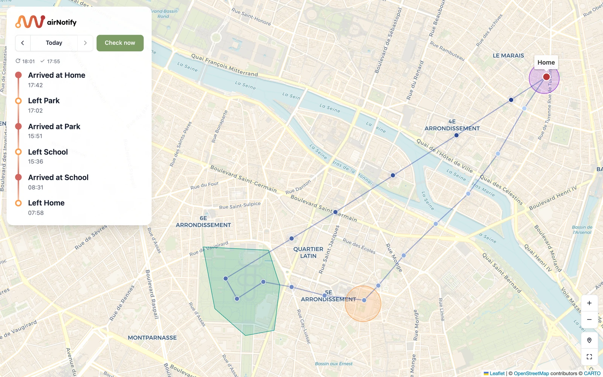
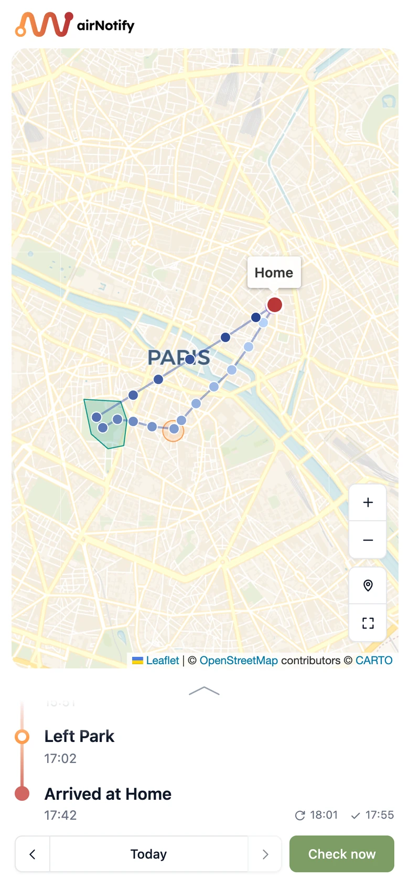

<h1>
  <picture>
    <source media="(prefers-color-scheme: dark)" srcset="docs/logo-on-dark.svg">
    
  </picture>
</h1>

Push notifications (via [ntfy](https://ntfy.sh)) when an AirTag arrives at or leaves places you define.
It's a small daemon built on [FindMy.py](https://github.com/malmeloo/FindMy.py) that polls Apple's Find My network every 15 minutes.
It runs on macOS or Linux (e.g. a Raspberry Pi).
Optionally, it keeps a location history and shows it on a map in your browser, phone included, from home or, [with Tailscale](#opening-the-viewer-from-anywhere-tailscale), from anywhere.

> [!NOTE]
> A hobby project, vibe coded with an AI assistant. It's also used every day by my family and me, so it's certified to work (on our machine, at least).

<p>
  
  
</p>

<sub>The map viewer on a computer and on a phone, with mock data.</sub>

## Where your data goes

| What | Where it lives | Who sees it |
|---|---|---|
| Apple ID password, iCloud tokens, device identity | Secret store, item `apple-session` | Apple only (the password never crosses the network; login uses SRP) |
| AirTag private keys | Secret store, item `airtag` | Nobody. Apple only receives hashes of the rotating public keys, and locations are decrypted locally |
| ntfy topic | Secret store, item `ntfy` | ntfy server |
| Alert text: zone name + time, **never coordinates** | ntfy | ntfy server |
| Zones (coordinates), alert text, schedule | `config.toml` in your clone (0600, gitignored) | Nobody |
| Zone state, queued alerts | `~/.config/air-notify/state.json` (0600) | Nobody |
| Location history (optional, off by default) | `~/.config/air-notify/history.jsonl` (0600, plain text) | You, in the [map viewer](#location-history-and-map-viewer-optional) |

**The secret store** depends on the platform:
- **macOS:** the Keychain, service `air-notify`.
- **Linux:** files in `~/.config/air-notify/*.cred`, encrypted with `systemd-creds --user`. That's AES-256-GCM, using the machine's host key and tied to your user. Without a TPM (e.g. a Raspberry Pi) the host key sits on disk, readable only by root. This protects against other users, copied files and leaks. It doesn't protect against someone who has root or holds the disk.

**Data directory:** `~/.config/air-notify` by default. It follows `$XDG_CONFIG_HOME`, and `$AIR_NOTIFY_HOME` overrides it. The code itself can live anywhere.

**Network hosts:** `gsa.apple.com`, `setup.icloud.com`, `gateway.icloud.com` and your ntfy server.
There is one more: `anisette.dl.mikealmel.ooo`, the FindMy.py maintainer's server. It's contacted **once**, to download Apple's anisette libraries into `ani_libs.bin`. It receives no account data.
The map viewer adds the map tile server, and [Tailscale](#opening-the-viewer-from-anywhere-tailscale) if you use it for remote access.

Other hardening:
- **Logging:** FindMy.py's own logs are capped at WARNING, because it logs the Apple ID at INFO and its anisette dependency logs device secrets at DEBUG.
- **Dependencies:** `findmy` is pinned to `>=0.10.2,<0.11`, because earlier versions skipped TLS verification. `uv.lock` pins every dependency by hash; review the FindMy.py changelog and diff before running `uv lock --upgrade`.

## Requirements

- **An AirTag owned by your Apple account.** Items shared with you can't be exported.
- **Your Apple account must not use Security Keys or passkey-only sign-in**, because FindMy.py can't log in with those. Check Settings → Apple Account → Sign-In & Security.
- **macOS**, or **Linux with systemd 256 or newer** (e.g. 64-bit Raspberry Pi OS based on Debian 13). The Linux machine must be **64-bit**, because `unicorn` has no 32-bit ARM builds.
- **[uv](https://docs.astral.sh/uv/)** and **git**.
- **The ntfy app** on your phone.

## Install

Clone the repo wherever you like, then:

```sh
# macOS
uv sync --locked --no-dev

# Linux: installs the locked dependencies, links `air-notify` into ~/.local/bin,
# and prepares the systemd user service (not started yet)
deploy/pi-service.sh setup
```

On Linux without uv, install it from the official release, checksum-verified (use `x86_64` instead of `aarch64` on a PC):

```sh
V=0.12.19 A=uv-aarch64-unknown-linux-gnu
curl -fsSLO https://github.com/astral-sh/uv/releases/download/$V/$A.tar.gz
curl -fsSLO https://github.com/astral-sh/uv/releases/download/$V/$A.tar.gz.sha256
sha256sum -c $A.tar.gz.sha256 && tar xzf $A.tar.gz && install -m 0755 $A/uv $A/uvx ~/.local/bin/
```

Commands below are written as `uv run air-notify …`, run inside the clone. On Linux, plain `air-notify …` works anywhere.

## Setup

### 1. Configure your zones

In the clone:

```sh
cp config.example.toml config.toml   # then edit it
```

`config.toml` is gitignored, so `git pull` never touches it. It does get deleted by `git clean -fdx`, so keep a copy if you ever run that.

air-notify looks for the config in this order:
1. `$AIR_NOTIFY_CONFIG`, if set.
2. `config.toml` in the clone.
3. `~/.config/air-notify/config.toml`.

Each zone is a name, coordinates and a radius. To get coordinates, right-click a spot in Google Maps and click the first line. Allow for AirTag positions often being 20–60 m off: about 100 m suits a home, and larger sites need more.

A circle fits some places badly, e.g. a long park or a campus, where a circle at the entrance misses most of it. Such a zone can be a custom shape instead: an `outline` with the corners in order, each as `[lat, lon]`. The last corner joins back to the first, and any shape works, including L-shapes.

```toml
[[zones]]
name = "Park"
outline = [
  [48.8484, 2.3327],
  [48.8483, 2.3398],
  [48.8443, 2.3389],
  [48.8445, 2.3352],
]
```

"Arrived" fires as soon as a report is inside the outline. "Left" only fires once a report is more than `exit_buffer_m` outside it, like with circles.

To poll less often at night, add a schedule by time of day:

```toml
[[intervals]]
time = "07:00"   # in quotes; TOML doesn't allow 0700
interval = 15

[[intervals]]
time = "20:00"
interval = 25

[[intervals]]
time = "00:00"
interval = 30
```

- **How it applies:** each entry runs from its time until the next one, wrapping past midnight.
- **Limit:** every interval must be at least 15 minutes.
- **Switching to a shorter interval:** e.g. 30 → 15 at 07:00, the next check moves up to that time instead of waiting out the old interval.

The alert text can be changed (e.g. into your language) under `[messages]`. A zone can also set its own `arrive` / `leave` text, which wins for that zone. That helps in languages where the wording depends on the place, e.g. "Chegou na escola" but "Chegou em casa".

### 2. Export the AirTag keys (once; the most sensitive step)

The keys come from iCloud via the **OpenTagViewer exporter**.
This version was audited before use:
- It contacts only Apple hosts and uses local anisette.
- It doesn't join your iCloud Keychain trust circle.
- It never writes your password or tokens to disk.

It needs your Apple ID, 2FA, and the screen-lock passcode of one of your devices. Run it yourself, in your own terminal, on any macOS or Linux machine.

```sh
umask 077 && mkdir -p ~/airtag-export && cd ~/airtag-export
git clone --branch exporter-v1.5.1 --depth 1 https://github.com/parawanderer/OpenTagViewer.git
git -C OpenTagViewer rev-parse HEAD      # must print bf9cf9b44e710fb07a2f83c7f5f9f8966a9636dc
cp ~/.config/air-notify/ani_libs.bin . 2>/dev/null || true   # reuse the libs if you have them
cd OpenTagViewer/python && uv sync --frozen --no-dev
uv run --no-dev python -m exporter.cli --source icloud --no-password \
  --anisette-libs ~/airtag-export/ani_libs.bin -o ~/airtag-export/tags.zip
```

- **At the item list,** move to the AirTag, tick it with **Space**, then press **Enter**. Nothing is ticked by default, and **a** ticks everything, including your own devices.
- **Don't pass `--anisette-url`.**
- **If 2FA loops:** when your account only offers SMS 2FA and it keeps asking for the code (OpenTagViewer issue #236), stop instead of burning codes.

Back in the air-notify clone, on the machine that will run the daemon, import the keys straight from the zip into the secret store. Nothing is extracted to disk.

```sh
uv run air-notify import-airtag ~/airtag-export/tags.zip --delete-source
```

**Clean up:**
- **The exporter's device:** open **account.apple.com → Devices** and remove the "MacBook Pro" entry (serial `0PENTAG…`) that the exporter signed in as.
- **Local files:** once you don't need the exporter any more, delete `~/airtag-export`, plus its device identity: `~/Library/Application Support/OpenTagViewer` on macOS, or `~/.config/opentagviewer` on Linux.
- **Optional:** keep a copy of `tags.zip` in your password manager before deleting it. Re-exporting is a hassle.

To run the daemon somewhere other than where you imported the keys, see [Moving to another machine](#moving-to-another-machine).

### 3. Log in and set up ntfy

```sh
uv run air-notify login      # Apple ID + password (hidden) + 2FA code
uv run air-notify set-ntfy   # topic (hidden) + sends a test push
uv run air-notify check      # one fetch: inside/outside + distance per zone
```

**The ntfy topic works like a password.** Anyone who knows it can read the alerts, so use a long random one, e.g. generated with your password manager (letters and digits only). Subscribe to it in the ntfy app, then give it to `set-ntfy`. The access-token prompt is only for self-hosted servers; press Enter to skip it.

### 4. Run it in the background

```sh
deploy/launchagent.sh install   # macOS: LaunchAgent, runs while you're logged in
deploy/pi-service.sh install    # Linux: systemd user service
```

- **Linux:** enable linger so the service also runs at boot without a login. Check with `loginctl show-user $USER -p Linger`, fix with `sudo loginctl enable-linger $USER`.
- **macOS:** nothing is polled while the Mac sleeps. If it's always on power, turn on System Settings → Battery → Options → "Prevent automatic sleeping on power adapter when the display is off".

### 5. Optional: the map viewer, at home and away

- **At home:** turn on the history and the viewer, see [Location history and map viewer](#location-history-and-map-viewer-optional).
- **Away from home:** reach it through Tailscale, see [Opening the viewer from anywhere](#opening-the-viewer-from-anywhere-tailscale).

## Day to day

```sh
uv run air-notify status                  # running? stopped? last report, zone states
uv run air-notify poll                    # check right now (also a button in the map viewer)
tail -f ~/Library/Logs/air-notify.log     # macOS logs
journalctl --user-unit air-notify -f       # Linux logs (in RAM only on Raspberry Pi OS: cleared on reboot)
deploy/launchagent.sh restart             # macOS, after editing config.toml
deploy/pi-service.sh restart              # Linux, after editing config.toml
deploy/pi-service.sh update               # Linux: git pull + locked deps + restart
```

Every safeguard that kicks in sends an ntfy alert:

| Situation | What the daemon does | You do |
|---|---|---|
| Apple rejects the session | Stops polling | `air-notify login` |
| Apple returns an error (429 rate limit, 503, anything unexpected) | Stops polling | `air-notify resume` when you're ready |
| Can't reach Apple (offline) | Retries once after 1 min, then every 15 min. One alert when the outage starts, one when it recovers | Nothing |
| Daemon crashed and restarted | Carries on. After 3 crashes within an hour it stops polling | `air-notify resume` |

**Checking right now:** `air-notify poll`, or **Check now** in the map viewer, asks the running daemon for an immediate check. The result goes into the history like any other.
- **One request at a time:** a manual check takes the place of the next scheduled one, and it never overlaps with one.
- **Limits:** it needs at least 5 minutes since the previous check, and it isn't available while polling is stopped.

A stopped daemon stays stopped across restarts and reboots. Alerts that can't be delivered are queued until ntfy is reachable again.

## Location history and map viewer (optional)

With `history_days = 30` in `config.toml`, the daemon appends every new report to `~/.config/air-notify/history.jsonl` and deletes lines older than 30 days once a day. The file is plain text, one JSON object per line:

```json
{"t": "2026-09-30T08:12:05+02:00", "lat": 52.12345, "lon": 13.12345, "acc": 35}
```

Only reports that arrive while the daemon runs are recorded. Apple keeps just the latest few, so there's no backfill.

The **map viewer** shows one recorded day at a time, in any browser. Enable it under `[viewer]` and the daemon serves it; `air-notify view` serves it on its own.

- **The map:** the day's reports as a path of dots, from light to dark blue by time. The latest is red, with a label naming the zone it's in, or its time outside every zone. Reports less accurate than `max_accuracy_m` are hidden, as they are for the alerts, and dots within 100 m of each other are merged. Your zones are drawn as circles or outlines.
- **Starting view:** today opens zoomed in on the latest location, and a past day shows the whole day. The map buttons switch between the two (**Last location**, **Whole day**).
- **The timeline:** the day's arrivals and departures, worked out with the same rules and wording as the alerts.
- **Days:** step through them with the arrows around the date, or tap the date to pick one in a calendar.
- **Check now:** asks the daemon for an immediate check (see [Day to day](#day-to-day)).
- **On a phone:** the map sits on top, with the latest events and the buttons below it. Older events fold away behind a chevron.

```toml
history_days = 30

[viewer]
enabled = true
host = "0.0.0.0"   # reachable from other devices on your network; default 127.0.0.1 (this machine only)
port = 8080
```

Then open `http://<machine>:8080`, e.g. `http://raspberrypi.local:8080`. Away from home, see [Tailscale](#opening-the-viewer-from-anywhere-tailscale) below.

- **No password:** with `host = "0.0.0.0"`, anyone on your network can see the history. Leave the default `127.0.0.1` to keep it to the machine itself; from elsewhere, use an SSH tunnel: `ssh -L 8080:localhost:8080 <user>@<host>`.
- **What else your browser loads:** only map tiles, from OpenStreetMap or the provider you choose (below). Leaflet and the logo's font are bundled into the page. The tile server sees which area you're looking at. The coordinates themselves only travel between the viewer and your browser.
- **Other websites can't read it:** the viewer only answers requests addressed to an IP address, `localhost`, a `.local` name or the machine's own name. That blocks DNS rebinding, where a website you visit points its own domain at your network to read pages from devices on it.

### Map styles

The default is OpenStreetMap's standard style. CARTO's styles are lighter and calmer behind your points, and need a free [CARTO key](https://carto.com/basemaps/apikey/):

| `[viewer] map =` | Look |
|---|---|
| `"osm"` (default) | OpenStreetMap standard, detailed |
| `"carto-voyager"` | Soft colours, clean labels |
| `"carto-positron"` | Very light grey |
| `"carto-dark-matter"` | Dark |

Each CARTO style also comes without place-name labels: add `-nolabels`, e.g. `"carto-positron-nolabels"`.

**Set it up:**
1. Save the key with `air-notify set-map-key`. It asks at a hidden prompt, checks that CARTO accepts the key (otherwise the tiles stay watermarked), and stores it in the secret store, never in `config.toml`. `$AIR_NOTIFY_MAP_KEY` overrides the saved key, for keys injected from a secrets manager.
2. Set `map` under `[viewer]`, then restart.

**Without a saved key,** a CARTO style falls back to OpenStreetMap and the viewer says so.

**The key is visible:** it's part of every tile request your browser makes, so anyone who opens the viewer can see it. If CARTO's dashboard allows it, restrict the key to the addresses you open the viewer from.

### Opening the viewer from anywhere (Tailscale)

The viewer has no password, so don't open it to the internet with port forwarding. To use it away from home, [Tailscale](https://tailscale.com) puts your phone and the machine on a private network of their own.
- **No router changes:** it works behind any internet connection, including ones without a public IPv4 address (CGNAT, DS-Lite).
- **Cost:** the free personal plan is enough.

1. **On the machine running air-notify** (Raspberry Pi OS, Debian). On a Mac, install the Tailscale app instead.
   ```sh
   curl -fsSL https://tailscale.com/install.sh | sh   # Tailscale's official installer
   sudo tailscale up                                  # prints a link: open it and sign in
   ```
2. **On your phone,** install the Tailscale app and sign in with the same account. Leave it on: it only carries traffic to your own devices, so the rest of your browsing is unaffected, on Wi-Fi or mobile data.
3. **In `config.toml`,** the viewer must listen beyond the machine itself: `host = "0.0.0.0"` under `[viewer]`. Restart after changing it.
4. **Open** `http://<machine>:8080` on the phone, where `<machine>` is the machine's name, e.g. `http://raspberrypi:8080`. This uses MagicDNS, which is on by default. The machine's Tailscale address works too, e.g. `http://100.101.102.103:8080`; the app shows it.

Good to know:
- **Names that don't work:** `.local` names only work on your home network. The long `<machine>.<tailnet>.ts.net` name is refused by the viewer's [DNS-rebinding guard](#location-history-and-map-viewer-optional). If you renamed the machine in Tailscale, the short name no longer matches its hostname; use the Tailscale address instead.
- **Who can reach it:** your home network, and the devices signed in to your Tailscale account.
- **What Tailscale sees:** its servers set up the connections and know which devices you have. The traffic itself is end-to-end encrypted (WireGuard) between your devices.

### Working on the viewer UI

The UI is a small Svelte + TypeScript app in `web/`. `npm run build` writes it into `src/air_notify/static/`, and those built files are committed, so the machine running air-notify never needs Node.

```sh
cd web
npm ci                                              # once
AIR_NOTIFY_API=http://raspberrypi.local:8080 npm run dev   # live reload, API forwarded to a running daemon
npm run check                                       # type check
npm run build                                       # before committing UI changes
```

- **Without a daemon:** set `AIR_NOTIFY_API` to an `air-notify view` running locally, which is the default (`http://localhost:8080`).
- **Saving the address:** put `AIR_NOTIFY_API=…` in `web/.env.local` (gitignored) instead of typing it each time.
- **Telling them apart:** the dev server uses the cream app icon, the built app the red one.
- **Registry:** `web/.npmrc` pins the public npm registry, so `package-lock.json` never points at a private one.

## Moving to another machine

For example, from a Mac to a Raspberry Pi. Only one machine may poll at a time.

1. **On the new machine,** [install](#install), then run `login` and `set-ntfy` there.
2. **From the old machine,** copy the config into the new clone, and the anisette libraries into the data directory:
   ```sh
   scp config.toml <user>@<host>:<clone>/
   scp ~/.config/air-notify/ani_libs.bin <user>@<host>:.config/air-notify/
   ```
3. **From the old machine,** copy `~/.config/air-notify/history.jsonl` as well, if you record history.
4. **From the old machine,** stream the AirTag keys over SSH into the new machine's secret store. They never touch the disk unencrypted, and `export-airtag` refuses to write to a screen or file.
   ```sh
   uv run air-notify export-airtag | ssh <user>@<host> '~/.local/bin/air-notify import-airtag - --yes'
   ```
5. **Switch over:**
   - stop the old daemon with `deploy/launchagent.sh uninstall` or `deploy/pi-service.sh uninstall`,
   - copy `~/.config/air-notify/state.json` to keep the current zone state,
   - run `deploy/pi-service.sh install` on the new machine (or `deploy/launchagent.sh install` on a Mac).
6. **Once the new machine runs fine,** delete the old machine's secrets. On macOS that's the three `air-notify` items in Keychain Access; on Linux, the `*.cred` files.

## Limitations

- **Near-owner blind spot:** Apple's network gets no reports while the AirTag is close to one of *your* devices. When you're home too, "arrived home" may not fire.
- **Latency:** usually 1–60 minutes, depending on other people's iPhones passing by. Alerts show when the tag was actually seen.
- **Apple changes:** changes on Apple's side occasionally break FindMy.py. Watch its releases.
- **One AirTag** per installation for now.
